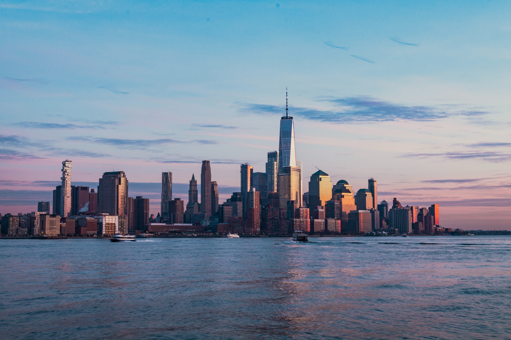

Originally, this post would've been about the 12 themes for this next phase in my life, written in 2020 about this upcoming decade. They would've partially repeated the same mantras as before, so instead I'll just leave three:

- be kinder
- fail more
- live vulnerably

The old ones, for posterity, were: [life] fail more, dream bigger, always be doing something; [love] be kinder, be more open, reach out and keep in touch; [health] live in the moment, eat and drink in moderation, exercise often; [work] find the biggest challenges, always be improving, work harder and smarter.

But part of new phases in life is realigning and rethinking, and maybe instead of "self-discovery", this is more about seeing the world through new, clearer eyes, and living for myself.

These past few years (the last post was 2019! but even before that) have been full of its ups and downs. Life has objectively been good, but it sometimes does seem like it's the same cycles and the same thoughts repeating. But maybe while the patterns are similar, it is true that many things have changed - and I'm a different (and hopefully better person for it).

Now is a new set of adventures (and struggles), even if often the same themes permeate, things have changed.

# new life new me

New York has been a fresh start, and while I may not have utilized this last year to its fullest potential, it's still been a journey.

A big part of these thoughts/worries have been too long coming for 3-4 years, where I think I entered a relatively non-self-reflective period of my life. I think it's been a very stressful and hectic time, from interview prepping twice to getting a full time CS degree, to (unfortunately) some periods of overly heavy (and probably a bit self-destructive) going out and partying.

It's definitely still been a ton of fun, and many great memories. But just as there are phases in life, sometimes we outlive something by living it out.

Over the last couple of months I managed to do a bit more soul-searching and reflecting - less so on who I am, but more on how I got there and what I want out of life, and these have been some of the conclusions.

  

# positivity

I do think that many of these posts end up seeming overwhelmingly negative. They can definitely feel at odds with being kinder [to my/yourself]. These thoughts aren't supposed to be depressing or sad, and more about openness and admitting weaknesses. It's been a long time coming, and I think embracing this is part of positivity and happiness.

So yeah, despite a lot of these being negative, these are happy thoughts 😁

It's also baby steps and life changes, and hey, this is all part of growth. 

# worries

Part of it is the wanting of being recognized, and wanting to show and know for certain that I am better [than others], and that everything was worth it.

Part of it is the defense mechanisms - of putting up walls, of lashing out, of bringing others down, and of jealousy and envy.

Part of it is still overthinking and overworrying.

Part of it is worrying heavily of what other people think of me - whether I'm doing the right thing, whether I'm successful, doing enough, and so on.

Part of it is still chasing happiness and meaning, and trying to decide on next steps in life.

# narrative structures
A big revelation are the beliefs about narrative structures that have shaped my life. I've always enjoyed fiction (aka fantasy/scifi), and those grand ideas and stories have impacted how I describe my own journeys. While it can be romantic idealism, it can also be the forceful fitting of life - with expected outcomes, targets to hit, etc.

I have also been thinking about what shapes *me* - what are *my* values, and how they have formed. I'm definitely too concerned about labels.

I've been thinking of how much of these values have been shaped by society - especially the ones that revolve around chasing impact and change. How much of what I really care about, are because someone else has convinced me that it's something worth fighting for?

I do think I overemphasize the glory of any large milestones in life, and definitely of how others perceive me and my story. It's hard not to have societal values, but I think when you buy in too much to those values is where the unsettledness begins.

# belonging

Definitely, I am still searching for home and belonging. I've moved a lot in the last few years, going from Toronto to Vancouver to New York. I don't think I could give a right answer to where "home" is. I'd say New York, but the real New Yorkers would have a field day with that one.

I've met some incredible people and some amazing stories, but finding the right tribe has been difficult. It's definitely been compounded by me being lazy/fearful of reaching out or opening up. I've definitely felt moments where I was surrounded by others, but still feeling alone and unknown.

After the first year, I do feel more settled down, and I hope this does change. I definitely recall not feeling fully comfortable in Toronto or Montreal for quite a while, so this will just be a combination of time and effort.

  

# these walls we put up

Life also forces us to shield who we are with our own defense mechanisms.

Sometimes it's judgment - being extra judgmental of others, and both keenly judgmental of ourselves while being extremely sensitive to the most casual of comments.

I am still very afraid of being hurt. And it can definitely come off as being emotionally distant and closed off, not letting even the closest friends (and SOs) in. This also leads to not being able to express myself truly - sometimes it is the shitty jokes and weird opinions, but sometimes it's the hopes and dreams and fears and worries.

This is also an effort to be more open, be more real, and to *tear down these walls*. The hard balance is being genuine but not "saying it like it is" for the sake of harshness.

# moments

I want to live in the moment more, and take the up and downs of life directly. I want to live vividly and enjoy the now, and see as much as I can see.

I think this is also about understanding others and understanding myself. While chasing the next big thing - the next job, next title, next project, next feeling of impact, can be fulfilling, we can't always live in the future and in the tomorrows.

This is also about paying more attention, of feeling both the ups and downs. I think this is an embracing of feelings, of boredom, of the interesting fleeting seconds of life. So no more casually browsing the latest Reddit posts or doing today's crossword while walking down the street - and maybe I'll meet someone interesting (or at least not get hit by a truck).

> *I wanna live, I wanna be right now. *
> *I wanna scream 'til my lungs give out. *
> *Oh, this is what it means to be alive. *

This has been one of my favorite songs of the past years. I do want to bbe right now, and know what it means to be alive. I've definitely had my fair share of sadboi music and light tears, and I don't want to lose that.

So this is to the right nows, these moments that make life what it is.

  <iframe width="100%" height="720" src="https://www.youtube.com/embed/lllu6wkWd0s" title="Dabin - Alive (Lyrics) feat. RUNN" frameborder="0" allow="accelerometer; autoplay; clipboard-write; encrypted-media; gyroscope; picture-in-picture" allowfullscreen></iframe>

# be brave

This rethinking is also about courage, about being brave.

Part of courage is being able to admit being wrong. Absolutely one of my weak points 😅

Part of courage is also vulnerability and openness - to accept the potential to be hurt and be judged.

Part of courage is the willingness to try, even when things seem scary.

> *We become brave by doing brave acts.*

And here's to crazy, fun, a little bit reckless decisions (that hopefully only hurt, but not break).

# today and tomorrow

It's the first time in a long while I've really gotten to take the time to reflect, and I'm glad I did. I think in many ways, I feel more sure than I did last year, and ideally in a healthier, subtly confident way.

I'm definitely okay and content - and even though this post is probably overly negative, I also do feel I have a tendency to overstate the negatives while being too quiet about the positives. Hopefully careful (in some ways) steps, a bit of therapy, and a bit of reflections will go a long way.

It's a conscious change to slow down, and maybe take life at my own pace.

It's also a rejection and letting go - of caring less, but caring more for the right, specific things.

So yeah, reaffirming these mantras for 2022 and for the foreseeable future:
- be kinder
- fail more
- live vulnerably

So this is to experiencing memories and seeing the world, and chasing ~vibes~ ✨
